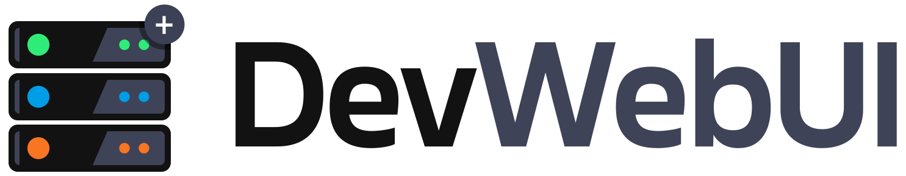
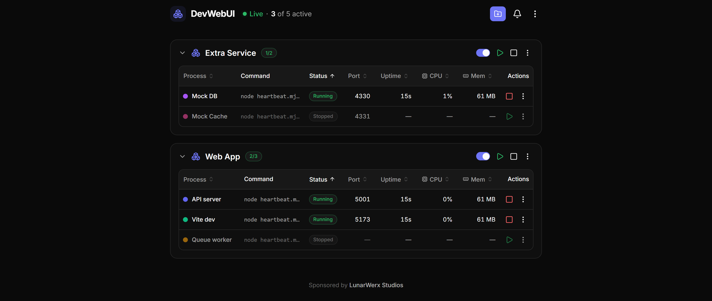
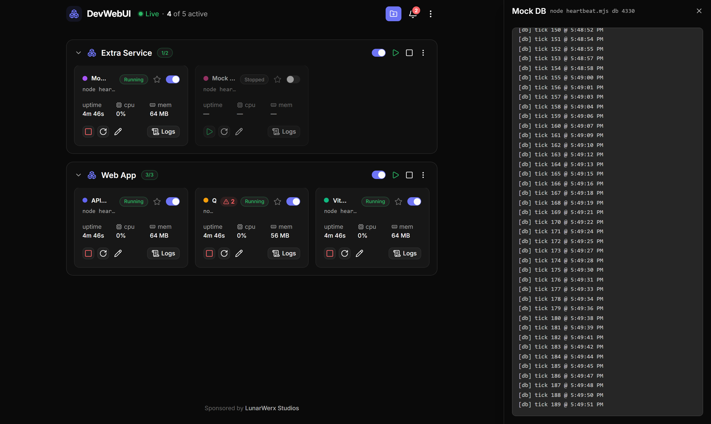
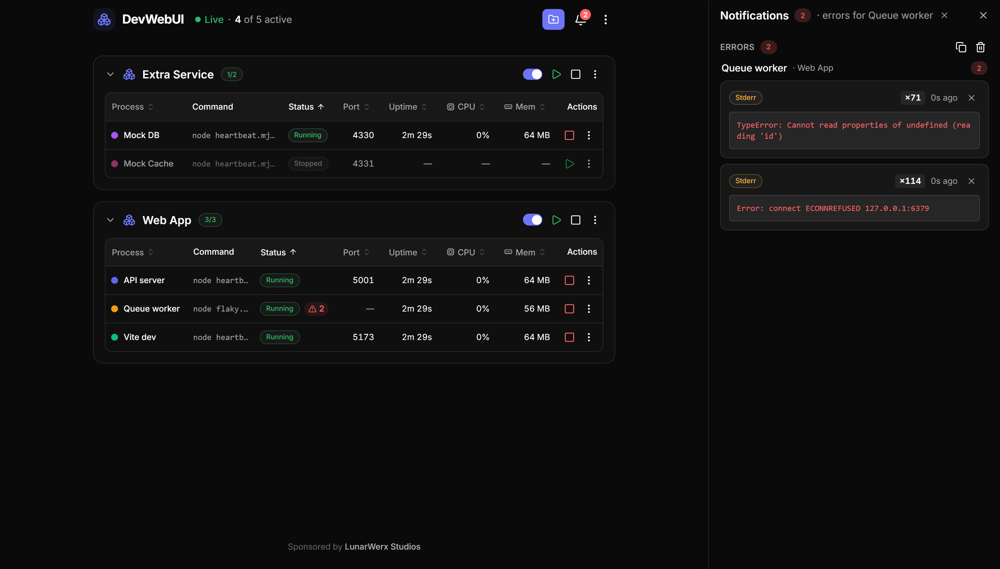
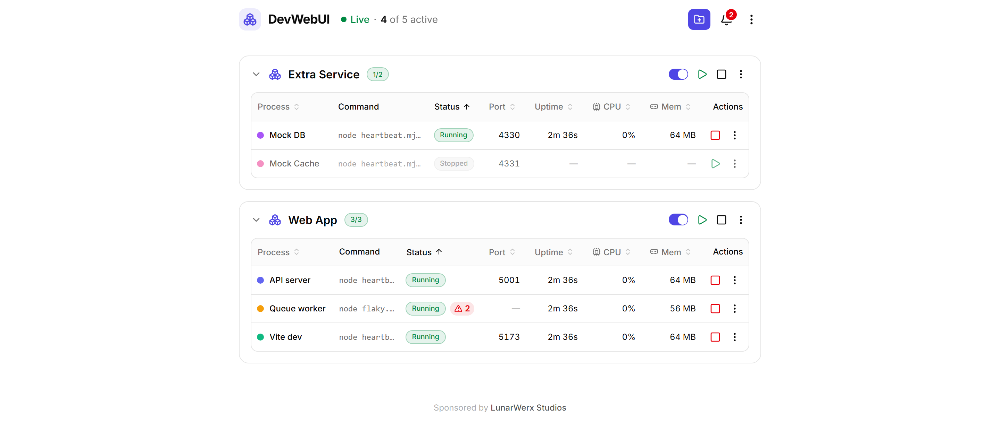

<div align="center">

<picture>
  <source media="(prefers-color-scheme: dark)" srcset="web/public/logo-dark.svg" />
  
</picture>

### A GUI **+ MCP** control plane for your local dev servers

Run every dev server from one pane — click to start, stop and restart, and watch live status, CPU,
memory and logs. Then let your AI agents drive the **same** daemon over MCP.<br/>
No more `bun run dev` babysitting across a dozen terminal tabs.

[**Website**](https://devwebui.github.io) · [Quick start](#run-it) · [`.devwebui` files](#devwebui-files) · [MCP](#drive-it-from-an-ai-agent-mcp) · [Changelog](CHANGELOG.md)

[](https://devwebui.github.io)
[](https://github.com/LunarWerxs/devwebui/actions/workflows/ci.yml)
[](https://github.com/LunarWerxs/devwebui/releases)
[](LICENSE)

<br/>



</div>

## Why it exists

The good local-dev GUIs (hotel, exo) are abandoned. PM2's web UI is paid. Everything else that's
still maintained is a TUI or a heavy container/k8s tool. Nobody ships the one thing you actually
want for a fleet of dev servers: **a GUI and MCP over one daemon** — so you click, your agents
automate, and everyone works off a single source of truth.

## Run it

**Windows** — double-click the **`DevWebUI`** shortcut. It runs hidden (no console window) with a
tray icon: right-click for **Open / Rebuild & Restart / Restart / Quit**. The first launch builds
once; after that it's instant. Changed the GUI? Hit **Rebuild & Restart**.

**Any OS** — from a terminal:

```bash
bun install
bun run dev      # daemon on :4000  +  GUI on http://localhost:4010
```

DevWebUI opens empty — drop a [`.devwebui` file](#devwebui-files) in a repo and click **Add
project**. Want something to click right away? Add `server/examples/extra.devwebui` (two
dependency-free heartbeat processes). The GUI and API share one port (default `4000`); if it's
taken, the daemon hops to the next free one and opens the URL it actually bound.

## What you get

- **One-click control** — start / stop / restart any dev server; live status, CPU, memory, logs.
- **One panel per repo** — a `.devwebui` file groups every process under one collapsible header; your projects auto-reload next launch.
- **Port-conflict rescue** — detects a taken port, tells you which process is holding it, and frees it on request.
- **Persistent error log** — de-duplicated stderr / crashes / error-looking stdout that survives restarts.
- **Built for agents** — 17 MCP tools drive the same daemon you click, off one shared state.
- **Localized & themed** — full i18n (English base; [add a language](web/src/i18n/README.md)), light/dark.
- **Lives in your tray** — a Windows tray app runs the daemon hidden; Open / Rebuild / Restart / Quit.

<table>
  <tr>
    <td width="50%" valign="top">
      <b>Live logs, streamed</b><br/>
      Tail any process without leaving the pane.<br/><br/>
      
    </td>
    <td width="50%" valign="top">
      <b>De-duplicated error log</b><br/>
      Repeats collapse into one entry with a count — and it survives restarts.<br/><br/>
      
    </td>
  </tr>
</table>

<p align="center"><sub>Dark by default — a light theme ships too.</sub></p>
<p align="center"></p>

## `.devwebui` files

One small file per repo lists the servers to run. Drop it in the repo root and click **Add project**:

```jsonc
{
  "name": "Connections",
  "processes": [
    { "id": "main", "name": "Main SPA",  "command": "bun run dev:main", "autostart": true },
    { "id": "pay",  "name": "Pay plane", "command": "bun run dev:pay",   "port": 4020 }
  ]
}
```

Per-process: `id`, `name`, `command`, plus optional `cwd`, `port`, `url`, `color`, `env`,
`autostart`. You can also add and edit processes right in the GUI — DevWebUI writes them back to
the file.

**Full field spec + a copy-paste prompt that writes the file for you →** [`AI_GUIDE.md`](AI_GUIDE.md)

## Drive it from an AI agent (MCP)

The MCP server is a thin stdio client over the running daemon, so the GUI and your agents share one
state. Start the daemon, then register:

```jsonc
{
  "mcpServers": {
    "devwebui": {
      "command": "bun",
      "args": ["server/src/mcp.ts"],
      "cwd": "/absolute/path/to/devwebui",
      "env": { "DEVWEBUI_URL": "http://localhost:4000" }
    }
  }
}
```

17 tools cover projects, processes (start/stop/restart, enable/disable, all), logs and the error
log. **Full list →** [`AI_GUIDE.md`](AI_GUIDE.md#for-an-ai-driving-devwebui-over-mcp)

## CLI

```bash
devwebui start | stop | status | list                 # boot / stop the daemon, inspect state
devwebui start-process | stop-process | restart-process <id|name>
devwebui start-all | stop-all
devwebui mcp                                           # the stdio MCP server for agents
```

A thin client over the same REST API the GUI and MCP use — run `devwebui --help` for the rest;
`DEVWEBUI_URL` / `DEVWEBUI_PORT` point it at another daemon.

## Stack

Bun + Hono daemon (HTTP + SSE) with a zero-dependency stdio MCP engine; Vue 3 + Vite, shadcn-vue on
Reka UI, Tailwind v4 (zinc + indigo, light/dark). See the [changelog](CHANGELOG.md) for what's landed.

## Local-first

DevWebUI runs entirely on your machine — a single daemon on your localhost, open source under the
[MIT License](LICENSE). Core functionality needs no account and no cloud. Two optional extras are
the only things that ever reach the network:

- **Settings sync** — sign in with a LunarWerx Connections account to sync a small allowlist of
  portable prefs + theme across machines. Off by default; only runs after you explicitly enable it
  in Settings, and `@cnct/connect`/`@cnct/locker` (the SDKs it needs) are optional dependencies
  that are installed but never imported or initialized unless you do.
- **Product pulse** — an anonymous, install-id-only usage ping (no path/machine/account info) sent
  on events like app-open and update-check. It's a no-op build-wide unless the person who *built*
  your copy configured a collector endpoint (`DEVWEBUI_PULSE_URL`); if they did and you'd rather it
  stayed off, set `DEVWEBUI_PULSE_DISABLE=1` to force it off regardless.

On the roadmap: macOS / Linux tray, an in-GUI env editor, log search, and multi-host.

Sponsored by **[LunarWerx Studios](https://lunarwerx.com/)**.
